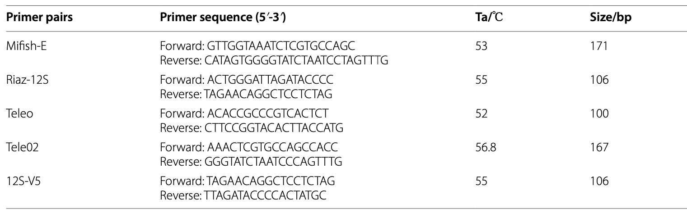
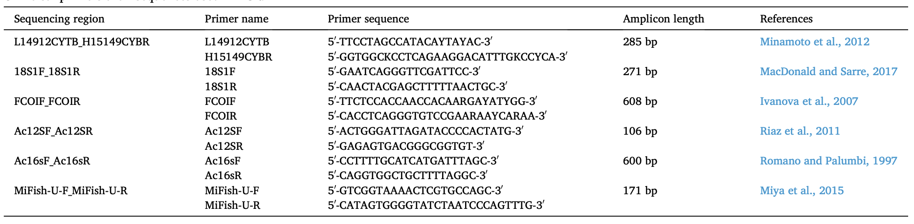

## 研究方法：ZOTU 与 OTU 和 ASV 的比较

|特性| 	OTU（97% 聚类）        | 	ZOTU（UNOISE3）    | 	ASV（DADA2/Deblur）     |
|-----|---------------------|-------------------|------------------------|
|定义方法| 	相似性聚类（阈值依赖）        | 	100% 相似性，基于去噪    |	精确去噪，单碱基分辨率|
|分辨率| 	较低，可能合并相似物种        | 	高，可区分单碱基差异       |	高，可区分单碱基差异|
|嵌合体处理| 	可能保留部分嵌合体	| 自动检测并移除嵌合体        |	自动检测并移除嵌合体|
|跨项目可比性| 		受阈值和工具影响          | 	高，基于精确序列定义       |	高，基于精确序列定义|
|计算需求|较低                   | 	中等               |	较高|
|常用工具| 		                 VSEARCH、USEARCH、Mothur| 	UNOISE3（USEARCH） |	DADA2、Deblur、QIIME 2|
|去噪方法| 		                  不去噪（基于聚类）	| 去噪（规则和经验方法）       |	去噪（统计模型）|

Operational Taxonomic Units:**OTUs**

Amplicon Sequence Variants:**ASVs**, also known as Exact Sequence Variants **(ESVs)**

zero-radius OTUs:**ZOTUs**

## bioinformatics pipeline

[Li Z, Zhao W, Jiang Y, et al. New insights into biologic interpretation of bioinformatic pipelines for fish eDNA metabarcoding: A case study in Pearl River estuary[J]. Journal of Environmental Management, 2024, 368: 122136.](https://www.sciencedirect.com/science/article/pii/S0301479724021224)

[Hakimzadeh A, Abdala Asbun A, Albanese D, et al. A pile of pipelines: An overview of the bioinformatics software for metabarcoding data analyses[J]. Molecular Ecology Resources, 2024, 24(5): e13847.](https://onlinelibrary.wiley.com/doi/abs/10.1111/1755-0998.13847)

## 构建docker镜像 [Build docker images](./Docker)

    cd Docker/
    docker build -t edna ./

## 构建数据库[Build database](./ref/)

    mkdir -p ref/ASV
    cd ref/ASV

## [primer](./primer/README.md)

1.  文献论述了在研究fish eDNA时引物的重要性,文章中指出 primers Riaz-12S and 12S-V5是一个很好的选择

[Min X, Li F, Zhang X, et al. Choice of primer pairs and PCR polymerase affect the detection of fish eDNA[J]. Environmental Sciences Europe, 2023, 35(1): 103.](https://link.springer.com/article/10.1186/s12302-023-00812-6)

2.  fish eDNA研究中几种引物的共同比较，研究表明还是Results indicate that MiFish consistently outperforms other primers, detecting the highest number of fish species
across all ecosystems and exhibiting superior taxonomic coverage.

[Xu Y, Huo X, Chen X, et al. Comparing the performance variability of different eDNA primers in fish monitoring[J]. Watershed Ecology and the Environment, 2024, 6: 165-175.](https://www.sciencedirect.com/science/article/pii/S2589471424000135)

3.   在研究环境DNA（eDNA）时，针对线粒体 细胞色素氧化酶 I（COI） 基因常用的引物如下。这些引物被广泛用于元条形码分析（metabarcoding）来检测多种动物的 DNA：

3-1.    Folmer引物对

    最经典的 COI 引物对，用于许多物种的 DNA 条形码分析。
    Forward (前向引物)：LCO1490
    序列：5'-GGTCAACAAATCATAAAGATATTGG-3'
    Reverse (反向引物)：HCO2198
    序列：5'-TAAACTTCAGGGTGACCAAAAAATCA-3'
3-2.    mlCOIintF 和 jgHCO2198

        这是改良的 COI 引物，专为提高环境样本中多样性检测的敏感性而设计，尤其适用于元条形码分析。
        Forward (前向引物)：mlCOIintF
        序列：5'-GGWACWGGWTGAACWGTWTAYCCYCC-3'
        Reverse (反向引物)：jgHCO2198
        序列：5'-TANACYTCNGGRTGNCCRAARAAYCA-3'
3-3. Leray引物对

    专为海洋生物研究优化，兼容广泛的无脊椎动物。
    Forward (前向引物)：Leray-XT
    序列：5'-GGTCAACAAATCATAAAGAYATYGG-3'
    Reverse (反向引物)：jgHCO2198
    序列：5'-TANACYTCNGGRTGNCCRAARAAYCA-3'
3-4. ANML 引物

    专门为淡水和陆地生物设计，用于eDNA样本中的多样性检测。
    Forward (前向引物)：ANML-F
    序列：5'-GGWACWRGWTGRACWITWTAAYCCYCC-3'
    Reverse (反向引物)：ANML-R
    序列：5'-TANACYTCIGGRTGNCCRAARAAYCA-3'