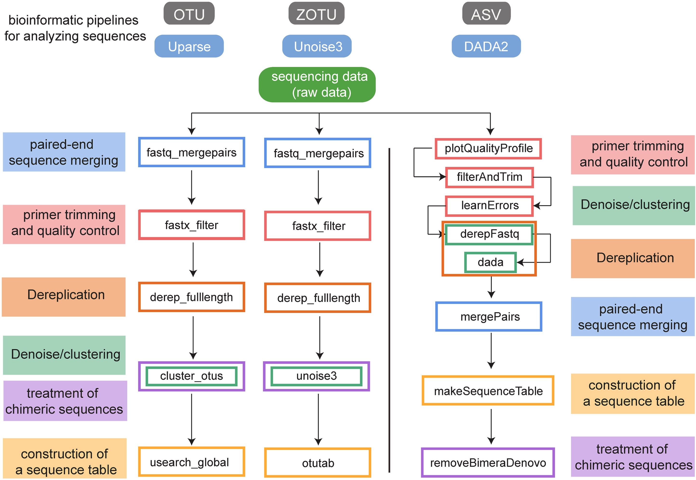

## 研究方法：ZOTU 与 OTU 和 ASV 的比较

|特性| 	OTU（97% 聚类）        | 	ZOTU（UNOISE3）    | 	ASV（DADA2/Deblur）     |
|-----|---------------------|-------------------|------------------------|
|定义方法| 	相似性聚类（阈值依赖）        | 	100% 相似性，基于去噪    |	精确去噪，单碱基分辨率|
|分辨率| 	较低，可能合并相似物种        | 	高，可区分单碱基差异       |	高，可区分单碱基差异|
|嵌合体处理| 	可能保留部分嵌合体	| 自动检测并移除嵌合体        |	自动检测并移除嵌合体|
|跨项目可比性| 		受阈值和工具影响          | 	高，基于精确序列定义       |	高，基于精确序列定义|
|计算需求|较低                   | 	中等               |	较高|
|常用工具| 		                 VSEARCH、USEARCH、Mothur| 	UNOISE3（USEARCH） |	DADA2、Deblur、QIIME 2|
|去噪方法| 		                  不去噪（基于聚类）	| 去噪（规则和经验方法）       |	去噪（统计模型）|

Operational Taxonomic Units:**OTUs**

Amplicon Sequence Variants:**ASVs**, also known as Exact Sequence Variants **(ESVs)**

zero-radius OTUs:**ZOTUs**

## Resources Link

[Li Z, Zhao W, Jiang Y, et al. New insights into biologic interpretation of bioinformatic pipelines for fish eDNA metabarcoding: A case study in Pearl River estuary[J]. Journal of Environmental Management, 2024, 368: 122136.](https://www.sciencedirect.com/science/article/pii/S0301479724021224)

[Hakimzadeh A, Abdala Asbun A, Albanese D, et al. A pile of pipelines: An overview of the bioinformatics software for metabarcoding data analyses[J]. Molecular Ecology Resources, 2024, 24(5): e13847.](https://onlinelibrary.wiley.com/doi/abs/10.1111/1755-0998.13847)

**MiFish pipeline**:https://mitofish.aori.u-tokyo.ac.jp/mifish/help/

**dada2_custom_fungal**:https://github.com/thierroll/dada2_custom_fungal

**16s rRNA demo data**:https://www.ncbi.nlm.nih.gov/bioproject/PRJEB27564

**nemabiome(dada2_ITS)**:https://www.nemabiome.ca **ITS**：https://www.nemabiome.ca/sequencing

**16S rDNA V3-V4 amplicon sequencing analysis using dada2, phyloseq, LEfSe, picrust2 and other tools.16S rDNA V3-V4 amplicon sequencing analysis using dada2, phyloseq, LEfSe, picrust2 and other tools.**:https://github.com/ycl6/16S-rDNA-V3-V4/

**Bioinformatic Methods for Biodiversity Metabarcoding**:https://learnmetabarcoding.github.io/LearnMetabarcoding/index.html

kraken2:SILVA 16s https://ftp.arb-silva.de **current version:138_2**

    mkdir -p ref/kraken2/16S_SILVA138_2
    docker run -v /staging/fanyucai/eDNA/ref/kraken2/16S_SILVA138_2:/ref/ edna sh -c 'export PATH=/opt/conda/bin:$PATH && sed -i s:138_1:138_2: /opt/conda/share/kraken2-2.1.3-4/libexec/16S_silva_installation.sh && kraken2-build --special silva --db /ref/ --threads 16 --kmer-len 51'

[Lu J, Salzberg S L. Ultrafast and accurate 16S rRNA microbial community analysis using Kraken 2[J]. Microbiome, 2020, 8(1): 124.](https://link.springer.com/article/10.1186/S40168-020-00900-2)

## Bioinformatics Pipeline

The data flow diagram is as follows:

### step1:docker images

    cd Docker/
    docker build -t edna ./

### [step2:build database](./ref/README.md)

### step3:download [demo data](./test_data/README.md) as you needed

### step4:The example command is as follows:

**16s rRNA pair-end(advice)**

    python3 script/fastqc.py -p1 test_data/16s/ERR2730388_1.fastq -p2 test_data/16s/ERR2730388_2.fastq -o outdir/16s_advice/1.fastqc/
    python3 script/fastqc.py -p1 test_data/16s/ERR2730395_1.fastq -p2 test_data/16s/ERR2730395_2.fastq -o outdir/16s_advice/1.fastqc/

    python3 script/fastp.py -p1 test_data/16s/ERR2730388_1.fastq -p2 test_data/16s/ERR2730388_2.fastq -p ERR2730388 -o outdir/16s_advice/2.fastp/
    python3 script/fastp.py -p1 test_data/16s/ERR2730395_1.fastq -p2 test_data/16s/ERR2730395_2.fastq -p ERR2730395 -o outdir/16s_advice/2.fastp/

    python3 script/cutadapt.py -n 16s_rRNA_V3-v4_341F-785R -r script/primer.tsv -l 300 -o outdir/16s_advice/3.cutadapt/ -p1 outdir/16s_advice/2.fastp/ERR2730388.clean_R1.fastq -p2 outdir/16s_advice/2.fastp/ERR2730388.clean_R2.fastq -p ERR2730388
    python3 script/cutadapt.py -n 16s_rRNA_V3-v4_341F-785R -r script/primer.tsv -l 300 -o outdir/16s_advice/3.cutadapt/ -p1 outdir/16s_advice/2.fastp/ERR2730395.clean_R1.fastq -p2 outdir/16s_advice/2.fastp/ERR2730395.clean_R2.fastq -p ERR2730395
    
    python3 script/dada2.py -s ref/qiime/silva-138.2-ssu-nr99-classifier.qza -g ref/qiime/2024.09.backbone.full-length.nb.qza -r ref/qiime/ncbi-refseqs-classifier.qza -i outdir/16s_advice/3.cutadapt/ -o outdir/16s_advice/4.dada2/
    python3 script/usearch.py -p1 outdir/16s_advice/3.cutadapt/ERR2730388_no_primer_R1.fastq.gz,outdir/16s_advice/3.cutadapt/ERR2730395_no_primer_R1.fastq.gz -p2 outdir/16s_advice/3.cutadapt/ERR2730388_no_primer_R2.fastq.gz,outdir/16s_advice/3.cutadapt/ERR2730395_no_primer_R2.fastq.gz -p ERR2730388,ERR2730395 -o outdir/16s_advice/5.usearch -s ref/qiime/silva-138.2-ssu-nr99-classifier.qza -g ref/qiime/2024.09.backbone.full-length.nb.qza -r ref/qiime/ncbi-refseqs-classifier.qza

**other:12s**

    python3 script/other.py -p1 test_data/12s/DRR030411_1.fastq,test_data/12s/DRR030422_1.fastq -p2 test_data/12s/DRR030411_2.fastq,test_data/12s/DRR030422_2.fastq -p DRR030411,DRR030422 -n 12s_rRNA_MiFish-U_MiFish-L -m script/primer.tsv -t 12s -g ref/qiime/2024.09.backbone.full-length.nb.qza -s12 ref/qiime/midori2-12s-classifier.qza -c ref/qiime/midori2-coi-classifier.qza -rfish ref/qiime/edna-fish-12S-16S-18S-classifier.qza -o outdir/12s -r ref/qiime/ncbi-refseqs-classifier.qza -s ref/qiime/silva-138.2-ssu-nr99-classifier.qza -i ref/qiime/unite_ver10_dynamic_s_all_19.02.2025-Q2-2024.10.qza -cfish ref/qiime/mitofish_COI-classifier.qza -rbcL /staging/fanyucai/eDNA/ref/qiime/NCBI_rbcL_Viridiplantae_classifier_2021_06_14.qza

**other:CO1**

    python3 script/other.py -p1 test_data/CO1/SRR9185140_1.fastq,test_data/CO1/SRR9185142_1.fastq -p2 test_data/CO1/SRR9185140_2.fastq,test_data/CO1/SRR9185142_2.fastq -p SRR9185140,SRR9185142 -n CO1_BF2R2 -m script/primer.tsv -t CO1 -g ref/qiime/2024.09.backbone.full-length.nb.qza -s12 ref/qiime/midori2-12s-classifier.qza -c ref/qiime/midori2-coi-classifier.qza -rfish ref/qiime/edna-fish-12S-16S-18S-classifier.qza -o outdir/CO1 -r ref/qiime/ncbi-refseqs-classifier.qza -s ref/qiime/silva-138.2-ssu-nr99-classifier.qza -i ref/qiime/unite_ver10_dynamic_s_all_19.02.2025-Q2-2024.10.qza -cfish ref/qiime/mitofish_COI-classifier.qza -rbcL /staging/fanyucai/eDNA/ref/qiime/NCBI_rbcL_Viridiplantae_classifier_2021_06_14.qza

**other:16s rRNA**

    python3 script/other.py -p1 test_data/16s/ERR2730388_1.fastq,test_data/16s/ERR2730395_1.fastq -p2 test_data/16s/ERR2730388_2.fastq,test_data/16s/ERR2730395_2.fastq -p ERR2730388,ERR2730395 -n 16s_rRNA_V3-v4_341F-785R -m script/primer.tsv -t 16s_single -g ref/qiime/2024.09.backbone.full-length.nb.qza -s12 ref/qiime/midori2-12s-classifier.qza -c ref/qiime/midori2-coi-classifier.qza -rfish ref/qiime/edna-fish-12S-16S-18S-classifier.qza -o outdir/16s -r ref/qiime/ncbi-refseqs-classifier.qza -s ref/qiime/silva-138.2-ssu-nr99-classifier.qza -i ref/qiime/unite_ver10_dynamic_s_all_19.02.2025-Q2-2024.10.qza -cfish ref/qiime/mitofish_COI-classifier.qza -rbcL /staging/fanyucai/eDNA/ref/qiime/NCBI_rbcL_Viridiplantae_classifier_2021_06_14.qza

**other:18s rRNA**

    python3 script/other.py -p1 test_data/18s/v9/SRR12793466_1.fastq,test_data/18s/v9/SRR12793467_1.fastq -p2 test_data/18s/v9/SRR12793466_2.fastq,test_data/18s/v9/SRR12793467_2.fastq -p SRR12793466,SRR12793467 -n 18s_rRNA_V9_1380F-1510R -m script/primer.tsv -t 18s -o outdir/18s -g ref/qiime/2024.09.backbone.full-length.nb.qza -s12 ref/qiime/midori2-12s-classifier.qza -c ref/qiime/midori2-coi-classifier.qza -rfish ref/qiime/edna-fish-12S-16S-18S-classifier.qza -r ref/qiime/ncbi-refseqs-classifier.qza -s ref/qiime/silva-138.2-ssu-nr99-classifier.qza -i ref/qiime/unite_ver10_dynamic_s_all_19.02.2025-Q2-2024.10.qza -cfish ref/qiime/mitofish_COI-classifier.qza -rbcL /staging/fanyucai/eDNA/ref/qiime/NCBI_rbcL_Viridiplantae_classifier_2021_06_14.qza

**other:ITS**

    python3 script/other.py -p1 test_data/ITS/SRR30683883_1.fastq,test_data/ITS/SRR30683886_1.fastq -p2 test_data/ITS/SRR30683883_2.fastq,test_data/ITS/SRR30683886_2.fastq -p SRR30683883,SRR30683886 -n ITS2_ITS7-ITS4 -m script/primer.tsv -t ITS -o outdir/ITS -g ref/qiime/2024.09.backbone.full-length.nb.qza -s12 ref/qiime/midori2-12s-classifier.qza -c ref/qiime/midori2-coi-classifier.qza -rfish ref/qiime/edna-fish-12S-16S-18S-classifier.qza -r ref/qiime/ncbi-refseqs-classifier.qza -s ref/qiime/silva-138.2-ssu-nr99-classifier.qza -i ref/qiime/unite_ver10_dynamic_s_all_19.02.2025-Q2-2024.10.qza -cfish ref/qiime/mitofish_COI-classifier.qza -rbcL /staging/fanyucai/eDNA/ref/qiime/NCBI_rbcL_Viridiplantae_classifier_2021_06_14.qza

**other:rbcL**

    python3 script/other.py -p1 test_data/rbcL/SRR12374561_1.fastq,test_data/rbcL/SRR12374563_1.fastq -p2 test_data/rbcL/SRR12374561_1.fastq,test_data/rbcL/SRR12374563_1.fastq -p SRR12374561,SRR12374563 -n rbcL2-F_rbcLa-R -m script/primer.tsv -t rbcL -o outdir/rbcL -g ref/qiime/2024.09.backbone.full-length.nb.qza -s12 ref/qiime/midori2-12s-classifier.qza -c ref/qiime/midori2-coi-classifier.qza -rfish ref/qiime/edna-fish-12S-16S-18S-classifier.qza -r ref/qiime/ncbi-refseqs-classifier.qza -s ref/qiime/silva-138.2-ssu-nr99-classifier.qza -i ref/qiime/unite_ver10_dynamic_s_all_19.02.2025-Q2-2024.10.qza -cfish ref/qiime/mitofish_COI-classifier.qza -rbcL /staging/fanyucai/eDNA/ref/qiime/NCBI_rbcL_Viridiplantae_classifier_2021_06_14.qza

    