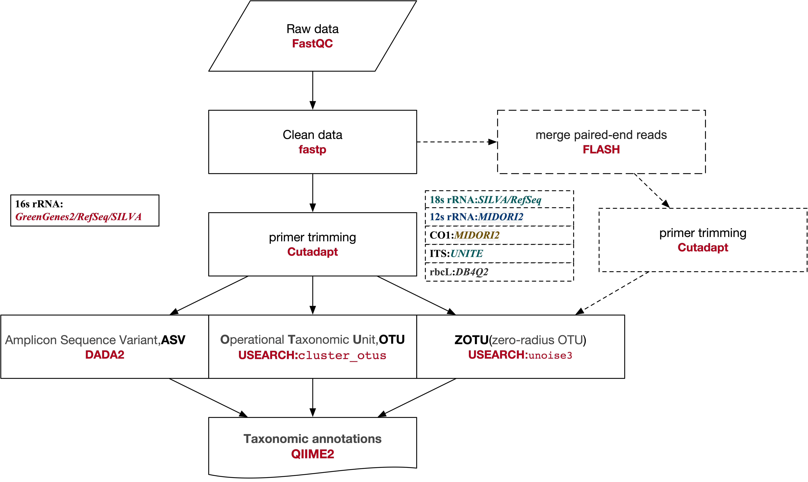

## 研究方法：ZOTU 与 OTU 和 ASV 的比较

|特性| 	OTU（97% 聚类）        | 	ZOTU（UNOISE3）    | 	ASV（DADA2/Deblur）     |
|-----|---------------------|-------------------|------------------------|
|定义方法| 	相似性聚类（阈值依赖）        | 	100% 相似性，基于去噪    |	精确去噪，单碱基分辨率|
|分辨率| 	较低，可能合并相似物种        | 	高，可区分单碱基差异       |	高，可区分单碱基差异|
|嵌合体处理| 	可能保留部分嵌合体	| 自动检测并移除嵌合体        |	自动检测并移除嵌合体|
|跨项目可比性| 		受阈值和工具影响          | 	高，基于精确序列定义       |	高，基于精确序列定义|
|计算需求|较低                   | 	中等               |	较高|
|常用工具| 		                 VSEARCH、USEARCH、Mothur| 	UNOISE3（USEARCH） |	DADA2、Deblur、QIIME 2|
|去噪方法| 		                  不去噪（基于聚类）	| 去噪（规则和经验方法）       |	去噪（统计模型）|

Operational Taxonomic Units:**OTUs**

Amplicon Sequence Variants:**ASVs**, also known as Exact Sequence Variants **(ESVs)**

zero-radius OTUs:**ZOTUs**

## Resources Link

[Li Z, Zhao W, Jiang Y, et al. New insights into biologic interpretation of bioinformatic pipelines for fish eDNA metabarcoding: A case study in Pearl River estuary[J]. Journal of Environmental Management, 2024, 368: 122136.](https://www.sciencedirect.com/science/article/pii/S0301479724021224)

[Hakimzadeh A, Abdala Asbun A, Albanese D, et al. A pile of pipelines: An overview of the bioinformatics software for metabarcoding data analyses[J]. Molecular Ecology Resources, 2024, 24(5): e13847.](https://onlinelibrary.wiley.com/doi/abs/10.1111/1755-0998.13847)

**MiFish pipeline**:https://mitofish.aori.u-tokyo.ac.jp/mifish/help/

**dada2_custom_fungal**:https://github.com/thierroll/dada2_custom_fungal

**nemabiome(dada2_ITS)**:https://www.nemabiome.ca **ITS**：https://www.nemabiome.ca/sequencing

**16S rDNA V3-V4 amplicon sequencing analysis using dada2, phyloseq, LEfSe, picrust2 and other tools.16S rDNA V3-V4 amplicon sequencing analysis using dada2, phyloseq, LEfSe, picrust2 and other tools.**:https://github.com/ycl6/16S-rDNA-V3-V4/

**Bioinformatic Methods for Biodiversity Metabarcoding**:https://learnmetabarcoding.github.io/LearnMetabarcoding/index.html

## Bioinformatics Pipeline

The data flow diagram is as follows

### prepare 

**docker images**

    cd Docker/
    docker build -t edna ./

**refernce**

    mkdir ref/
    python3 script/qiime_Greengene2_RefSeq_SILVA.py -v 138.2 -o ref/

**16s rRNA demo data**:https://www.ncbi.nlm.nih.gov/bioproject/PRJEB27564

[Aho V T E, Pereira P A B, Voutilainen S, et al. Gut microbiota in Parkinson's disease: temporal stability and relations to disease progression[J]. EBioMedicine, 2019, 44: 691-707.](https://www.thelancet.com/journals/ebiom/article/PIIS2352-3964(19)30372-X/fulltext)

### example:

    python3 script/fastqc.py -p1 test_data/ERR2730388_1.fastq -p2 test_data/ERR2730388_2.fastq -o outdir/1.fastqc/

    python3 script/fastp.py -p1 test_data/ERR2730395_1.fastq -p2 test_data/ERR2730395_2.fastq -p ERR2730395 -o outdir/2.fastp/

    python3 script/cutadapt.py -n 16s_rRNA_V3-v4_341F-785R -r script/primer.tsv -l 300 -o outdir/3.cutadapt/ -p1 outdir/2.fastp/ERR2730395.clean_R1.fastq -p2 outdir/2.fastp/ERR2730395.clean_R2.fastq -p ERR2730395

    python3 script/dada2_v2.0.py -s ref/qiime/silva-138.2-ssu-nr99-classifier.qza -g ref/2024.09.backbone.full-length.nb.qza -r ref/ncbi-refseqs-classifier.qza -i outdir/3.cutadapt/ -o outdir/4.dada2/

    python3 script/usearch_v2.0.py -p1 outdir/3.cutadapt/ERR2730388_no_primer_R1.fastq.gz,outdir/3.cutadapt/ERR2730391_no_primer_R1.fastq.gz -p2 outdir/3.cutadapt/ERR2730388_no_primer_R2.fastq.gz,outdir/3.cutadapt/ERR2730391_no_primer_R2.fastq.gz -p ERR2730388,ERR2730391 -o outdir/test/ -g ref/qiime/2024.09.backbone.full-length.nb.qza -r ref/qiime/ncbi-refseqs-classifier.qza