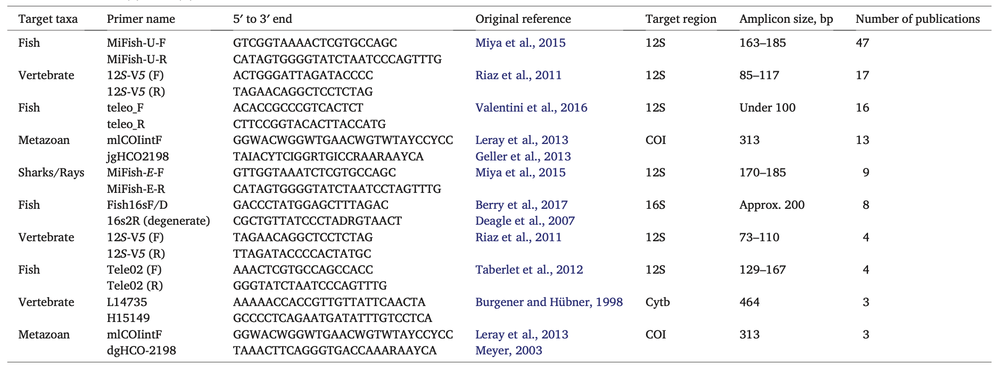
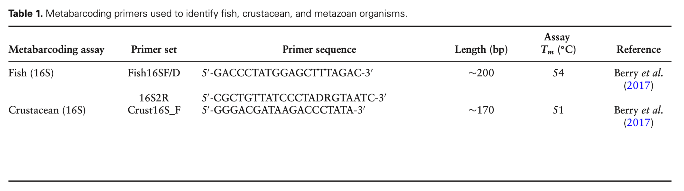

# Observing_Life_in_the Sea_Using_Environmental_DNA

**List of the 10 most commonly used metabarcoding primers in aquatic eDNA research**

[Takahashi M, Saccò M, Kestel J H, et al. Aquatic environmental DNA: A review of the macro-organismal biomonitoring revolution[J]. Science of the Total Environment, 2023, 873: 162322.](https://www.sciencedirect.com/science/article/pii/S0048969723009385)

## ITS region

[Vancov T, Keen B. Amplification of soil fungal community DNA using the ITS86F and ITS4 primers[J]. FEMS microbiology letters, 2009, 296(1): 91-96.](https://academic.oup.com/femsle/article/296/1/91/485778?login=true)

[Bellemain E, Carlsen T, Brochmann C, et al. ITS as an environmental DNA barcode for fungi: an in silico approach reveals potential PCR biases[J]. BMC microbiology, 2010, 10: 1-9.](https://link.springer.com/article/10.1186/1471-2180-10-189)

[Op De Beeck M, Lievens B, Busschaert P, et al. Comparison and validation of some ITS primer pairs useful for fungal metabarcoding studies[J]. PloS one, 2014, 9(6): e97629.](https://journals.plos.org/plosone/article?id=10.1371/journal.pone.0097629)

## 16s rRNA

[Fadeev E, Cardozo-Mino M G, Rapp J Z, et al. Comparison of two 16S rRNA primers (V3–V4 and V4–V5) for studies of arctic microbial communities[J]. Frontiers in microbiology, 2021, 12: 637526.](https://www.frontiersin.org/journals/microbiology/articles/10.3389/fmicb.2021.637526/full)

[Babis W, Jastrzebski J P, Ciesielski S. Fine-Tuning of DADA2 Parameters for Multiregional Metabarcoding Analysis of 16S rRNA Genes from Activated Sludge and Comparison of Taxonomy Classification Power and Taxonomy Databases[J]. International Journal of Molecular Sciences, 2024, 25(6): 3508.](https://www.mdpi.com/1422-0067/25/6/3508)

[Na H S, Song Y, Yu Y, et al. Comparative analysis of primers used for 16S rRNA gene sequencing in oral microbiome studies[J]. Methods and Protocols, 2023, 6(4): 71.](https://www.mdpi.com/2409-9279/6/4/71)

[Adams C I M, Jeunen G J, Cross H, et al. Environmental DNA metabarcoding describes biodiversity across marine gradients[J]. ICES Journal of Marine Science, 2023, 80(4): 953-971.](https://academic.oup.com/icesjms/article/80/4/953/7058017?login=false)

## 18s rRNA

V4 (expected amplicon size, 270 bp–387bp) and V9 (expected amplicon size, 96 bp–134bp)

[Zheng X, He Z, Wang C, et al. Evaluation of different primers of the 18S rRNA gene to profile amoeba communities in environmental samples[J]. Water Biology and Security, 2022, 1(3): 100057.](https://www.sciencedirect.com/science/article/pii/S2772735122000774)

## 12s rRNA

[Oliveira Carvalho C, Pazirgiannidi M, Ravelomanana T, et al. Multi-method survey rediscovers critically endangered species and strengthens Madagascar's freshwater fish conservation[J]. Scientific Reports, 2024, 14(1): 20427.](https://www.nature.com/articles/s41598-024-71398-z)

[Miya M, Sato Y, Fukunaga T, et al. MiFish, a set of universal PCR primers for metabarcoding environmental DNA from fishes: detection of more than 230 subtropical marine species[J]. Royal Society open science, 2015, 2(7): 150088.](https://royalsocietypublishing.org/doi/full/10.1098/rsos.150088)

文献论述了在研究fish eDNA时引物的重要性,文章中指出 primers Riaz-12S and 12S-V5是一个很好的选择

[Min X, Li F, Zhang X, et al. Choice of primer pairs and PCR polymerase affect the detection of fish eDNA[J]. Environmental Sciences Europe, 2023, 35(1): 103.](https://link.springer.com/article/10.1186/s12302-023-00812-6)

fish eDNA研究中几种引物的共同比较，研究表明还是Results indicate that MiFish consistently outperforms other primers, detecting the highest number of fish species
across all ecosystems and exhibiting superior taxonomic coverage.

## CO1

[Hajibabaei M, Porter T M, Wright M, et al. COI metabarcoding primer choice affects richness and recovery of indicator taxa in freshwater systems[J]. PLoS One, 2019, 14(9): e0220953.](https://journals.plos.org/plosone/article?id=10.1371/journal.pone.0220953)

在研究环境DNA（eDNA）时，针对线粒体 细胞色素氧化酶 I（COI） 基因常用的引物如下。这些引物被广泛用于元条形码分析（metabarcoding）来检测多种动物的 DNA：
 
**Folmer引物**

    最经典的 COI 引物对，用于许多物种的 DNA 条形码分析。
    Forward (前向引物)：LCO1490
    序列：5'-GGTCAACAAATCATAAAGATATTGG-3'
    Reverse (反向引物)：HCO2198
    序列：5'-TAAACTTCAGGGTGACCAAAAAATCA-3'

**mlCOIintF 和 jgHCO2198**

        这是改良的 COI 引物，专为提高环境样本中多样性检测的敏感性而设计，尤其适用于元条形码分析。
        Forward (前向引物)：mlCOIintF
        序列：5'-GGWACWGGWTGAACWGTWTAYCCYCC-3'
        Reverse (反向引物)：jgHCO2198
        序列：5'-TANACYTCNGGRTGNCCRAARAAYCA-3'

**Leray引物**

    专为海洋生物研究优化，兼容广泛的无脊椎动物。
    Forward (前向引物)：Leray-XT
    序列：5'-GGTCAACAAATCATAAAGAYATYGG-3'
    Reverse (反向引物)：jgHCO2198
    序列：5'-TANACYTCNGGRTGNCCRAARAAYCA-3'

**ANML 引物**

    专门为淡水和陆地生物设计，用于eDNA样本中的多样性检测。
    Forward (前向引物)：ANML-F
    序列：5'-GGWACWRGWTGRACWITWTAAYCCYCC-3'
    Reverse (反向引物)：ANML-R
    序列：5'-TANACYTCIGGRTGNCCRAARAAYCA-3'

## [Earth Microbiome Project](https://earthmicrobiome.org/) 

- [16S Illumina Amplicon Protocol:v4-(515F–806R) V4-V5 (515F-926R)](https://earthmicrobiome.org/protocols-and-standards/16s/)
- [18S Illumina Amplicon Protocol:v9-(Euk1391f-EukBr)](https://earthmicrobiome.org/protocols-and-standards/18s/)
- [ITS Illumina Amplicon Protocol:(ITS1f-ITS2)](https://earthmicrobiome.org/protocols-and-standards/its/)
