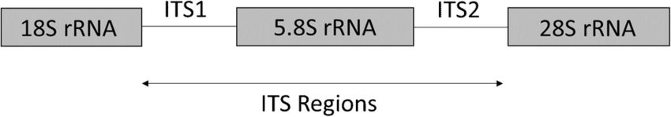
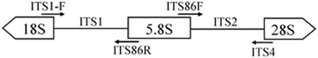
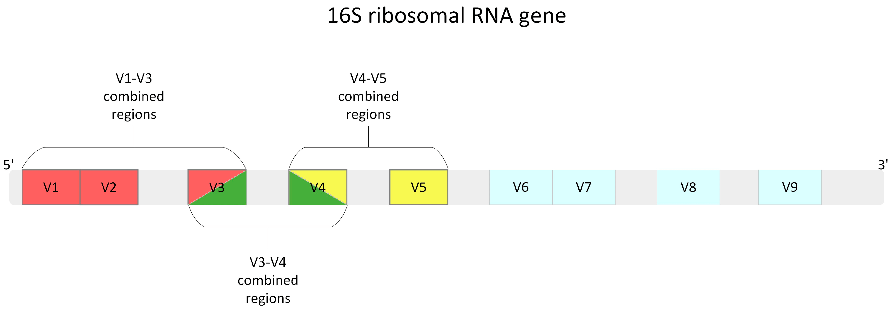
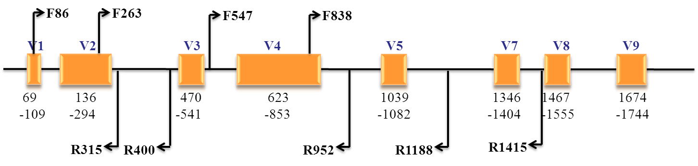
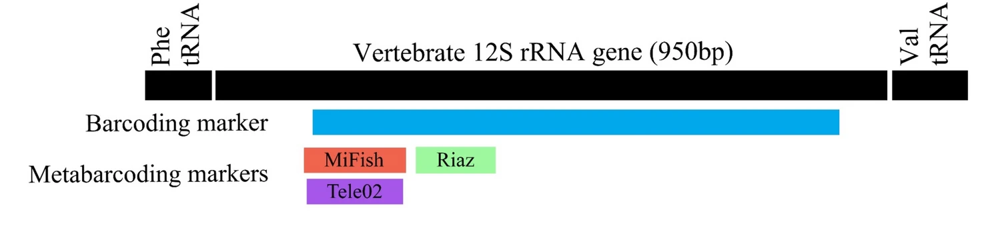
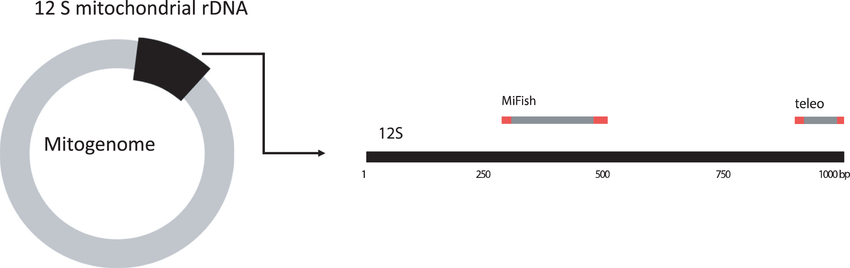
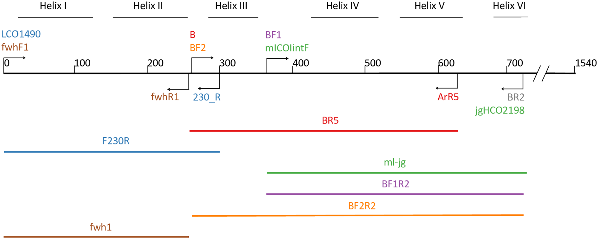

# Observing_Life_in_the Sea_Using_Environmental_DNA

## ITS region

[Vancov T, Keen B. Amplification of soil fungal community DNA using the ITS86F and ITS4 primers[J]. FEMS microbiology letters, 2009, 296(1): 91-96.](https://academic.oup.com/femsle/article/296/1/91/485778?login=true)

[Bellemain E, Carlsen T, Brochmann C, et al. ITS as an environmental DNA barcode for fungi: an in silico approach reveals potential PCR biases[J]. BMC microbiology, 2010, 10: 1-9.](https://link.springer.com/article/10.1186/1471-2180-10-189)

[Op De Beeck M, Lievens B, Busschaert P, et al. Comparison and validation of some ITS primer pairs useful for fungal metabarcoding studies[J]. PloS one, 2014, 9(6): e97629.](https://journals.plos.org/plosone/article?id=10.1371/journal.pone.0097629)

## 16s 

[Fadeev E, Cardozo-Mino M G, Rapp J Z, et al. Comparison of two 16S rRNA primers (V3–V4 and V4–V5) for studies of arctic microbial communities[J]. Frontiers in microbiology, 2021, 12: 637526.](https://www.frontiersin.org/journals/microbiology/articles/10.3389/fmicb.2021.637526/full)

[Babis W, Jastrzebski J P, Ciesielski S. Fine-Tuning of DADA2 Parameters for Multiregional Metabarcoding Analysis of 16S rRNA Genes from Activated Sludge and Comparison of Taxonomy Classification Power and Taxonomy Databases[J]. International Journal of Molecular Sciences, 2024, 25(6): 3508.](https://www.mdpi.com/1422-0067/25/6/3508)

[Na H S, Song Y, Yu Y, et al. Comparative analysis of primers used for 16S rRNA gene sequencing in oral microbiome studies[J]. Methods and Protocols, 2023, 6(4): 71.](https://www.mdpi.com/2409-9279/6/4/71)

## 18s rRNA

V4 (expected amplicon size, 270 bp–387bp) and V9 (expected amplicon size, 96 bp–134bp)

[Zheng X, He Z, Wang C, et al. Evaluation of different primers of the 18S rRNA gene to profile amoeba communities in environmental samples[J]. Water Biology and Security, 2022, 1(3): 100057.](https://www.sciencedirect.com/science/article/pii/S2772735122000774)

## 12s

12S-V5-F(also names:Riaz) (5′-ACTGGGATTAGATACCCC-3′)

12S-V5-R (5′-TAGAACAGGCTCCTCTAG-3′)

[Blabolil P, Harper L R, Říčanová Š, et al. Environmental DNA metabarcoding uncovers environmental correlates of fish communities in spatially heterogeneous freshwater habitats[J]. Ecological Indicators, 2021, 126: 107698.](https://www.sciencedirect.com/science/article/pii/S1470160X21003630)

[Miya M, Sato Y, Fukunaga T, et al. MiFish, a set of universal PCR primers for metabarcoding environmental DNA from fishes: detection of more than 230 subtropical marine species[J]. Royal Society open science, 2015, 2(7): 150088.](https://royalsocietypublishing.org/doi/full/10.1098/rsos.150088)

## CO1

[Hajibabaei M, Porter T M, Wright M, et al. COI metabarcoding primer choice affects richness and recovery of indicator taxa in freshwater systems[J]. PLoS One, 2019, 14(9): e0220953.](https://journals.plos.org/plosone/article?id=10.1371/journal.pone.0220953)

## [Earth Microbiome Project](https://earthmicrobiome.org/) 

- [16S Illumina Amplicon Protocol:v4-(515F–806R) V4-V5 (515F-926R)](https://earthmicrobiome.org/protocols-and-standards/16s/)
- [18S Illumina Amplicon Protocol:v9-(Euk1391f-EukBr)](https://earthmicrobiome.org/protocols-and-standards/18s/)
- [ITS Illumina Amplicon Protocol:(ITS1f-ITS2)](https://earthmicrobiome.org/protocols-and-standards/its/)